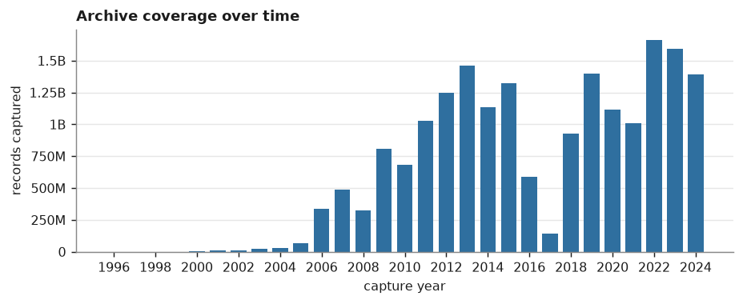
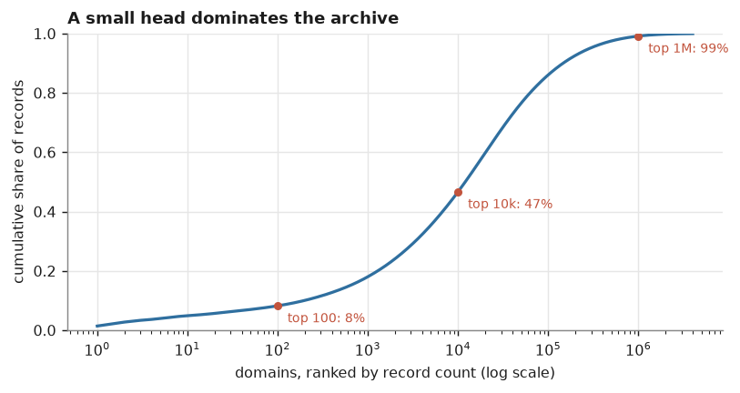
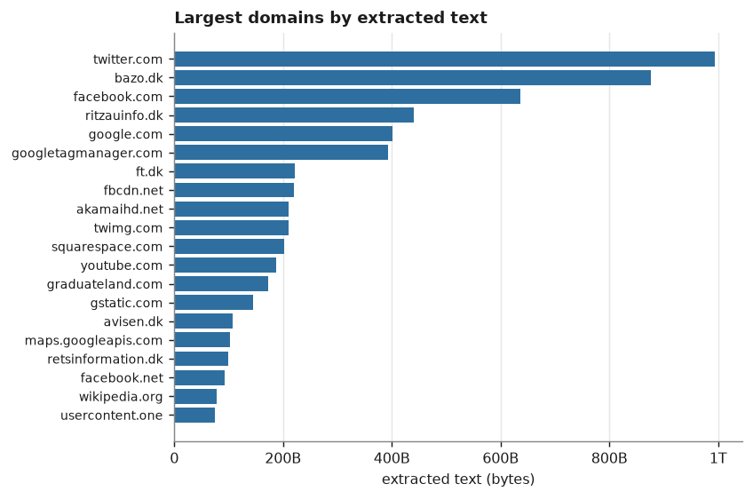
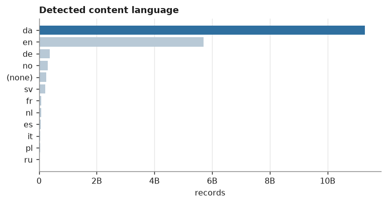
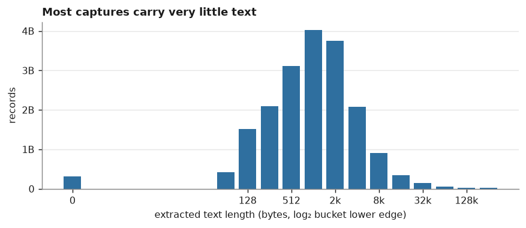

# Netarkivet — metadata analysis

> **⚠ DRAFT — 24 of 170 shards processed.** Numbers below are from a partial scan and will change. Structure and methodology are final.

An analysis of the metadata for **Netarkivet**, the Danish national web archive run by
the Royal Danish Library. This repository contains the domain inventory of the archive
as it was delivered to us, the list of domains the library could not release, and a
description of what the collection actually contains.

It analyses **metadata only** — one row per archived URL capture, with no page content.
The source export is 170 CSV shards totalling 3.89 TiB in `/work/metadata`; those files
are not part of this repository.

## Repository layout

```
├── README.md                     this file: structure + analysis
├── data/
│   ├── domains.txt.gz            every domain in the archive, one per line, sorted
│   ├── domains_stats.tsv.gz      per-domain: records, text bytes, first/last capture
│   └── domains_removed.txt       the 2,500 domains the library could not release
├── analysis/
│   ├── summary.json              every number quoted below, machine-readable
│   ├── per_shard.tsv             per-shard record counts, for spotting a bad shard
│   └── figures/                  the charts below (svg + png)
└── src/
    ├── shardstat.c               single-pass scanner over one shard
    ├── merge.py                  merges per-shard aggregates into data/ + analysis/
    ├── report.py                 renders the tables in this README from summary.json
    ├── figures.py                renders analysis/figures/
    └── run.sh                    the whole pipeline
```

### The data files

`data/domains.txt.gz` is the plain inventory — every distinct domain observed, lowercased
and sorted. `data/domains_stats.tsv.gz` adds the minimum useful statistics per domain:

| column | meaning |
|---|---|
| `domain` | the domain as recorded in the export, lowercased |
| `records` | number of URL captures |
| `text_bytes` | sum of `content_text_length` over those captures |
| `first_capture` | earliest capture date, `YYYYMMDD` |
| `last_capture` | latest capture date, `YYYYMMDD` |

Both are gzipped: uncompressed the domain list alone is past GitHub's 100 MB file limit.
Read them with `zcat`/`zgrep` — no decompression step needed:

```sh
zgrep -x 'dr\.dk' data/domains.txt.gz
zcat data/domains_stats.tsv.gz | awk -F'\t' '$2 > 1000000'
```

### `domains_removed.txt`

These 2,500 domains are **not** a publisher opt-out list. They are domains whose content
can be subject to *offentlig handel* — public commercial trade — which means the Royal
Danish Library is not able to hand them over to us. The restriction sits with the
library's legal position, not with a choice made by the site owners.

They were removed **before** the export reached us: the shard files are named
`filtered_shard_*` because the filter had already been applied. The list is therefore a
record of what is missing, and the analysis below audits how completely the filter ran.

## Source format

Each row of the export is one archived URL capture:

```
"hash","wayback_date","status_code","content_language","domain","url","content_type_full","content_text_length"
```

`hash` is the SHA-1 of the page content, `wayback_date` a `YYYYMMDDhhmmss` timestamp, and
`content_text_length` the byte length of the extracted text. The content itself is not
included — hence `-no-content` in the filenames.

## Analysis

### Headline numbers

| | |
|---|---|
| Records (URL captures) | **2,811,279,649** |
| Unique domains | **3,999,249** |
| Extracted text | **10.03 TB** |
| Distinct content hashes (est.) | 2,450,491,898 (12.8% of records are exact content duplicates) |
| Distinct URLs (est.) | 1,597,091,144 (1.76 captures per URL) |
| Capture period | 1998–2017 |
| Shards scanned | 24 |

### Parse outcome

| outcome | records | share |
|---|---:|---:|
| complete | 2,758,418,481 | 98.120% |
| truncated before `content_text_length` | 19,853,757 | 0.706% |
| truncated inside the URL | 33,007,411 | 1.174% |
| unparseable (dropped) | 0 | 0.000% |

Truncated records still yield a domain, date, status and language; only `content_type` / `content_text_length` are lost for 1.88% of records. Records lost entirely: **0**. Counter overflows: **0**.

The archive is large but far more redundant than the raw record count suggests. Roughly
one record in eight is an exact content duplicate of another, and the average URL was
captured more than once — so the number of *distinct pages* is materially smaller than
the number of rows.

### Coverage over time



Denmark's legal deposit act for online material took effect on **1 July 2005**, and the
data shows that switch almost to the month: fewer than 7,000 records per month through
May 2005, then 1.26 M in June and 2.29 M in July. Everything before 2005 is a thin tail
of pilot harvests, not systematic collection — treat pre-2005 coverage as anecdotal.

Collection then grows to a peak in the mid-2010s before dropping sharply in the final
year, which is an artefact of where this export was cut rather than a change in the
archive itself.

### Domain concentration



The archive has a very long tail. Most domains appear a handful of times, while a small
head carries a large share of the volume.

The head is also not what you would want from a *Danish* corpus. The largest domains by
volume are dominated by international social media and CDN/asset hosts — `twitter.com`,
`facebook.com`, `akamaihd.net`, `twimg.com`, `fbcdn.net`, `gstatic.com`. These are
captured because Danish pages embed them, not because they are Danish content. Anyone
building a text corpus from this should expect to filter the head aggressively.



### Language



Danish is the plurality but not the whole archive — a large English share reflects both
genuinely English pages on Danish sites and the embedded international domains above.
Note this column is the crawler's *detected* language and inherits its error rate;
short pages in particular are detected unreliably.

### How much text is actually there



The distribution is heavily weighted toward very short captures. A large fraction of
records carry only a few hundred bytes of extracted text — redirects, error pages,
navigation stubs, asset responses. The usable text is concentrated in a minority of
records, which is why `text_bytes` per domain is a better size proxy than record count.

### What the records are

Not every record is a successful page fetch. Error and redirect responses are archived
too and carry a `content_text_length` of their own (error pages have text), so they
inflate naive size estimates.

## Data quality

Three issues in the source export are worth knowing about; all three are handled by the
scanner in `src/`, and all three would silently corrupt a naive analysis.

### 1. The CSV is not valid RFC4180

About 1.9% of records are truncated mid-record: they lose the trailing
`,"content_type","length"`, and sometimes part of the URL, leaving a quote unclosed.

```
"sha1:226EW5A35H6XX4I2VLDUQSCYHVHXEGYP","20100410015123","200","en","nose.dk","http://andersen.nose.dk/desctracker.php?trail=I18,F15,I299
```

A standard CSV reader — Python's `csv`, pandas, polars, DuckDB — resynchronises by
consuming the *next* record into the unterminated field, so each truncated record
destroys a second, intact one. On a 400 MB sample that silently dropped 33,169 records
(1.9%) and 1,870 domains (0.8%).

`shardstat.c` instead anchors on the record delimiter `\n"sha1:` and parses from both
ends. The first five fields contain no commas or quotes, so five scans for `","` peel
them exactly; `content_text_length` and `content_type` are peeled from the right. A
truncated record still yields its domain, date, status and language. On the same sample
this parses **every** record with zero failures.

### 2. A duplicated shard

`filtered_shard_90b-no-content.csv` is a **byte-exact prefix** of
`filtered_shard_90-no-content.csv` — 17.7 GB of the same 24.5 GB file, an aborted earlier
export run. Processing the directory with a glob double-counts about 72% of shard 90.
This analysis uses shards 1–170 and excludes `90b`.

### 3. Counter width

The record count is ~10¹⁰ and the text total ~10¹⁴, both well past 32-bit. Every
accumulator here is `uint64_t` in C with `__builtin_add_overflow` checks, and Python's
arbitrary-precision `int` in the merge; no float or `awk` accumulator touches a count.
The overflow counter is reported in `summary.json` rather than assumed to be zero.

Shards are effectively disjoint: sampling two shards, only 0.008% of records were true
duplicates (identical hash, date and domain), so cross-shard double counting is
negligible.

## Removal audit

The 2,500 restricted domains were filtered out before the export reached us, so the
question this repository can answer is whether the filter ran completely. Mostly it did
— the major titles are gone; `dr.dk`, `politiken.dk`, `tv2.dk` and `berlingske.dk`
return nothing.

But the filter leaked.

- listed for removal: **2,500**
- correctly absent from the export: **2,488**
- **still present (filter leak): 12**, accounting for 233,191 records (0.0083% of the archive) and 1.16 GB of text
- malformed entries in the list (no TLD): `xn--nytomtrenotat`, `xn--sndagaf19`

| domain | records | extracted text | first capture | last capture |
|---|---:|---:|---:|---:|
| `avis.dk` | 182,893 | 981.20 MB | 20050618 | 20171117 |
| `der.dk` | 18,493 | 108.63 MB | 20061121 | 20171122 |
| `boen.dk` | 15,799 | 14.93 MB | 20050619 | 20160915 |
| `dk.dk` | 9,477 | 26.15 MB | 20050619 | 20171122 |
| `vikinglife.com` | 2,317 | 2.90 MB | 20070704 | 20080511 |
| `bangolufsen.com` | 2,104 | 14.66 MB | 20130513 | 20150602 |
| `dbdk.dk` | 1,844 | 9.84 MB | 20150930 | 20170620 |
| `onsdag.dk` | 225 | 372.42 kB | 20090629 | 20170313 |
| `randersonsdag.dk` | 23 | 425.05 kB | 20131121 | 20160131 |
| `selv.dk` | 10 | 2.65 kB | 20070827 | 20101224 |
| `makasse.dk` | 4 | 508 B | 20120820 | 20130302 |
| `bjerringbroavis.dk` | 2 | 2.15 kB | 20160613 | 20160613 |

These are genuine records, verified against the raw CSV — real domains with real URLs,
not artefacts of the repair parser. **If this export is used to build a corpus, these
domains should be purged first.**

## Reproducing

```sh
src/run.sh /work/metadata          # scan + merge + figures; JOBS=24 by default
```

Stage 1 scans 3.89 TiB and is the expensive part — the filesystem here tops out around
1.3 GB/s aggregate regardless of worker count, so budget roughly two hours. Per-shard
aggregates land in `_agg/` and are checkpointed, so an interrupted run resumes rather
than restarting. Stage 2 merges them into `data/` and `analysis/`.

Requirements: a C compiler and Python 3; `matplotlib` only for `figures.py`.

## Caveats

- **Metadata only.** No page content was read, so nothing here says anything about text
  quality, only about volume and shape.
- **`content_text_length` is a byte count** from the original extraction, not a token
  count, and it includes boilerplate.
- **Language is the crawler's detection**, not ground truth.
- **Distinct-URL and distinct-hash figures are HyperLogLog estimates** (p=14, ~0.8%
  expected error; measured +0.44% against an exact count on the validation sample). All
  other numbers are exact.
- **Coverage ends where this export was cut**, not where the archive ends. The final
  year is partial.
- **This is the filtered export.** It is not the whole of Netarkivet — the restricted
  domains are absent by design.

## Reference tables

### Largest domains by extracted text

| # | domain | records | extracted text |
|---:|---|---:|---:|
| 1 | `twitter.com` | 39,685,853 | 255.58 GB |
| 2 | `ritzauinfo.dk` | 16,628,218 | 123.92 GB |
| 3 | `google.com` | 8,788,409 | 103.29 GB |
| 4 | `akamaihd.net` | 833,422 | 83.96 GB |
| 5 | `twimg.com` | 204,427 | 72.12 GB |
| 6 | `fbcdn.net` | 1,051,163 | 61.73 GB |
| 7 | `facebook.com` | 37,318,496 | 47.47 GB |
| 8 | `gstatic.com` | 230,749 | 41.13 GB |
| 9 | `ft.dk` | 6,682,773 | 31.75 GB |
| 10 | `facebook.net` | 188,631 | 28.67 GB |
| 11 | `avisen.dk` | 8,722,875 | 26.20 GB |
| 12 | `tagdel.dk` | 2,149,170 | 22.59 GB |
| 13 | `youtube.com` | 7,502,386 | 22.49 GB |
| 14 | `tv2oj.dk` | 3,955,727 | 21.15 GB |
| 15 | `wikipedia.org` | 5,299,778 | 17.83 GB |

### Largest domains by record count

| # | domain | records | extracted text |
|---:|---|---:|---:|
| 1 | `twitter.com` | 39,685,853 | 255.58 GB |
| 2 | `facebook.com` | 37,318,496 | 47.47 GB |
| 3 | `ritzauinfo.dk` | 16,628,218 | 123.92 GB |
| 4 | `google.com` | 8,788,409 | 103.29 GB |
| 5 | `avisen.dk` | 8,722,875 | 26.20 GB |
| 6 | `youtube.com` | 7,502,386 | 22.49 GB |
| 7 | `ft.dk` | 6,682,773 | 31.75 GB |
| 8 | `wikipedia.org` | 5,299,778 | 17.83 GB |
| 9 | `tv2oj.dk` | 3,955,727 | 21.15 GB |
| 10 | `arto.com` | 2,903,327 | 5.28 GB |
| 11 | `vimeo.com` | 2,493,810 | 5.87 GB |
| 12 | `linkedin.com` | 2,389,333 | 6.23 GB |
| 13 | `emediate.dk` | 2,385,417 | 1.54 GB |
| 14 | `pinterest.com` | 2,339,607 | 2.60 GB |
| 15 | `news.dk` | 2,158,952 | 9.86 GB |

### Concentration

| top N domains | share of records | share of text |
|---:|---:|---:|
| 10 | 4.9% | 8.5% |
| 100 | 8.2% | 14.6% |
| 1,000 | 18.0% | 26.9% |
| 10,000 | 46.7% | 55.0% |
| 100,000 | 86.1% | 87.2% |

### Language

| language | records | share |
|---|---:|---:|
| da | 1,703,603,842 | 60.60% |
| en | 780,660,180 | 27.77% |
| de | 70,973,419 | 2.52% |
| no | 50,842,557 | 1.81% |
| (none) | 45,164,516 | 1.61% |
| sv | 30,993,350 | 1.10% |
| fr | 14,149,178 | 0.50% |
| nl | 13,078,722 | 0.47% |
| es | 11,825,924 | 0.42% |
| it | 7,828,280 | 0.28% |

### Content type

| MIME type | records | share |
|---|---:|---:|
| `text/html` | 1,556,157,213 | 55.35% |
| `application/xhtml+xml` | 1,018,361,349 | 36.22% |
| `text/plain` | 46,684,387 | 1.66% |
| `application/rss+xml` | 36,786,057 | 1.31% |
| `(truncated)` | 33,007,411 | 1.17% |
| `text/css` | 27,965,772 | 0.99% |
| `text/x-php` | 16,877,934 | 0.60% |
| `application/javascript` | 16,131,159 | 0.57% |
| `application/pdf` | 14,701,619 | 0.52% |
| `application/xml` | 14,224,446 | 0.51% |

### HTTP status

| status | records | share |
|---:|---:|---:|
| 200 | 2,486,122,118 | 88.43% |
| 404 | 250,437,418 | 8.91% |
| 302 | 32,203,542 | 1.15% |
| 301 | 23,803,584 | 0.85% |
| 403 | 6,953,252 | 0.25% |
| 500 | 4,003,957 | 0.14% |
| 503 | 2,875,261 | 0.10% |
| 303 | 1,775,941 | 0.06% |

### TLDs

| TLD | domains | records |
|---|---:|---:|
| .dk | 1,631,668 | 2,295,912,041 |
| .com | 1,223,190 | 303,124,861 |
| .de | 165,421 | 18,959,651 |
| .net | 128,594 | 38,797,349 |
| .org | 118,683 | 32,720,221 |
| .uk | 109,337 | 6,012,893 |
| .se | 42,867 | 8,447,996 |
| .no | 38,751 | 5,980,907 |
| .it | 36,023 | 3,687,933 |
| .info | 33,848 | 5,240,124 |

### Records per year

| year | records |
|---:|---:|
| 1998 | 5,787 |
| 1999 | 22,461 |
| 2000 | 33,575 |
| 2001 | 36,901 |
| 2002 | 6,832 |
| 2003 | 16,835 |
| 2004 | 46,570 |
| 2005 | 25,670,542 |
| 2006 | 81,724,509 |
| 2007 | 160,661,302 |
| 2008 | 86,171,366 |
| 2009 | 206,571,064 |
| 2010 | 110,923,839 |
| 2011 | 270,750,670 |
| 2012 | 347,231,343 |
| 2013 | 444,267,663 |
| 2014 | 314,098,383 |
| 2015 | 524,438,572 |
| 2016 | 210,436,496 |
| 2017 | 28,164,939 |
